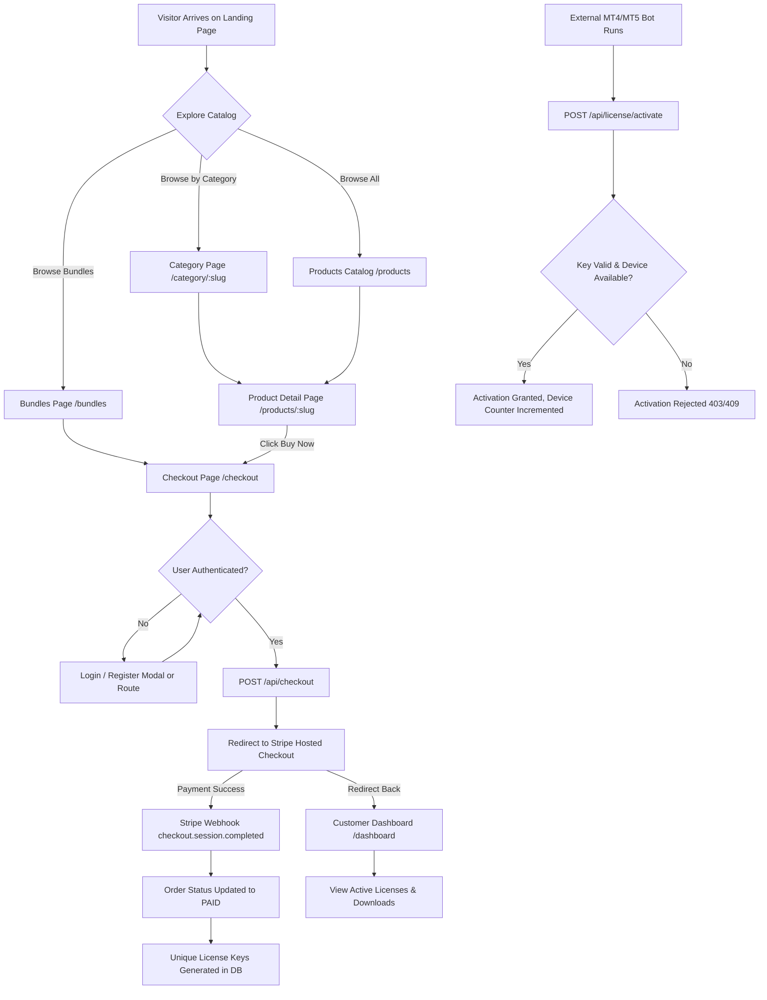

# Luxfocuss — Existing Website Technical & Product Overview

> **Context**: Prepared for developer onboarding and hiring evaluation based on Section 2 of the candidate test specification:
> *"Your first responsibility is to understand the existing website, its user flow, design language, functionality, and technical implementation. Do not immediately start coding. First understand the product."*

---

## 1. Product Overview & Purpose

### What is Luxfocuss?
**Luxfocuss** is a specialized direct-to-consumer (D2C) marketplace and software licensing platform targeting algorithmic and systematic financial traders. It operates in the same industry niche as **LuxAlgo**, **MarketCipher**, and the **MQL5 Market**.

### Target Audience
* Retail Forex traders (specializing in currency pairs like EURUSD, GBPUSD).
* Gold / Metals traders (specifically **XAUUSD** breakout and session traders).
* Prop firm challenge traders (individuals trading with funded account rules requiring strict drawdown controls).
* Systematic and quantitative traders using **MetaTrader 4 (MT4)**, **MetaTrader 5 (MT5)**, and **TradingView**.

### Core Product Offerings
1. **Expert Advisors (EAs)**: Fully automated trading robots that execute trades on MT4/MT5 platforms (e.g., *Gold Hunter EA*, *Trading Engine EA*).
2. **Indicators**: Custom charting scripts for TradingView (Pine Script) and MT5 that highlight market structure, liquidity sweeps, fair value gaps (FVG), and order flow (e.g., *Liquidity Pro*, *Smart Structure Pro*).
3. **Trading Systems**: Documented multi-indicator rulesets and execution manuals (e.g., *Trend Velocity*, *Confluence PRO*).
4. **Trading Tools / Utilities**: Spread protectors, session guards, and risk calculators.
5. **Managed Forex VPS**: High-availability, low-latency remote servers to keep EAs running 24/7 without home internet interruptions.

---

## 2. End-to-End User Flows



### Flow Breakdown:
1. **Discovery & Exploration**:
   * Visitors land on [`/`](file:///e:/personal/luxfocuss-main/src/app/page.tsx) with hero metrics, live market setup previews (XAUUSD), product categories, and top-ranked bots.
   * Dropdowns in the [`SiteHeader`](file:///e:/personal/luxfocuss-main/src/components/site-header.tsx) route users to categories (`/category/ea-bots`, `/category/tradingview-indicators`, etc.) or educational resources (`/performance`, `/education`, `/documentation`).
2. **Evaluation**:
   * On [`/products/:slug`](file:///e:/personal/luxfocuss-main/src/app/products/[slug]/page.tsx), users inspect strategy details, backtest metrics (Profit Factor, Max Drawdown, Win Rate), technical specs, and included features.
3. **Purchasing**:
   * Clicking "Buy Now" routes to [`/checkout`](file:///e:/personal/luxfocuss-main/src/app/checkout/page.tsx).
   * Checkout initiates `POST /api/checkout`, creating a `PENDING` order in the database and returning a Stripe Checkout session URL.
4. **Fulfillment & Licensing**:
   * Upon successful payment, Stripe fires a webhook to [`/api/webhooks/stripe`](file:///e:/personal/luxfocuss-main/src/app/api/webhooks/stripe/route.ts).
   * The webhook marks the order as `PAID` and creates unique license keys prefixed with `LUXF-` in the `License` table.
5. **Product Activation (Client-Side Trading Bot)**:
   * When the customer installs the EA on MetaTrader, the bot pings [`/api/license/validate`](file:///e:/personal/luxfocuss-main/src/app/api/license/validate/route.ts) and [`/api/license/activate`](file:///e:/personal/luxfocuss-main/src/app/api/license/activate/route.ts) to verify validity and increment device activation counts.

---

## 3. Design Language & Aesthetics

The website implements a **modern, high-tech dark trading aesthetic** engineered to convey institutional financial credibility:

### Color Palette
* **Canvas / Background**: Ultra-dark charcoal and obsidian tones:
  * Base page background: `#05070b`
  * Card / Container background: `#0b1118`
  * Inset / Input background: `#0d161d` and `rgba(2, 6, 23, 0.6)` (`slate-950/60`)
* **Primary Brand Accent**: Vibrant Financial Green / Emerald:
  * Accents: `text-emerald-300`, `bg-emerald-500` (`#10b981`)
  * Hover states: `hover:bg-emerald-400`, `hover:border-emerald-400/40`
  * Radial glow gradients: `radial-gradient(circle, rgba(16,185,129,0.18), transparent)`
* **Status Colors**:
  * Amber / Yellow (`text-amber-300`, `bg-amber-500/10`): Warnings, sample records, high-risk disclaimers, expiring licenses.
  * Rose / Red (`text-rose-300`, `text-red-300`): Stop Loss (SL), errors, failed states.
* **Neutral Typography**:
  * Headings: Pure white (`#ffffff`)
  * Secondary / Meta text: `text-slate-300`, `text-slate-400`, `text-slate-500`

### Typography & Structure
* **Fonts**: Loaded via `next/font/google`:
  * Primary Sans: **Geist**
  * Monospace / Data: **Geist Mono**
* **Micro-Typography**: Heavy use of uppercase micro-labels with wide letter spacing:
  * Example: `text-[10px] uppercase tracking-[0.25em] text-emerald-300`
* **Card & Border Styling**:
  * Rounded corners: Continuous smooth curves (`rounded-[1.5rem]`, `rounded-[2rem]`, `rounded-full`).
  * Subtly borders: Translucent white hairline borders (`border border-white/10`).
  * Glassmorphism & Depth: Backdrop blur (`backdrop-blur-xl`), inner glows, and dark shadow drops (`shadow-[0_20px_50px_rgba(16,185,129,0.12)]`).

---

## 4. Technical Implementation & Architecture

### Stack Components
* **Framework**: Next.js 16.3.5 (App Router with React 19.2.8)
* **Styling**: Tailwind CSS v4 with `@tailwindcss/postcss`
* **ORM & Database**: Prisma ORM 6.16.2 using SQLite (`prisma/dev.db`) locally
* **Payment Processor**: Official Stripe Node SDK (`stripe@^22.6.2`)
* **Cryptography & Auth**: Node.js native `node:crypto` (`scrypt`, `randomBytes`, `timingSafeEqual`)

### Directory Breakdown
```text
luxfocuss-main/
├── prisma/
│   ├── schema.prisma       # Prisma models: User, Session, Product, Order, OrderItem, License
│   ├── dev.db              # Local SQLite database file
│   └── seed.cjs            # Seed script populating 20 products, 1 demo user, demo order & license
├── public/
│   └── images/             # Vector chart and hero graphics (hero-chart.svg, indicator-chart.svg)
├── src/
│   ├── app/
│   │   ├── (storefront)/   # Public routes: /, /products, /pricing, /bundles, /performance, etc.
│   │   ├── admin/          # Admin operations page (/admin)
│   │   ├── api/            # Backend API Route Handlers
│   │   │   ├── auth/       # /api/auth/login, /api/auth/register
│   │   │   ├── checkout/   # /api/checkout (Stripe Session generation)
│   │   │   ├── license/    # /api/license/activate, /api/license/validate
│   │   │   ├── orders/     # /api/orders (Order creation)
│   │   │   └── webhooks/   # /api/webhooks/stripe (Payment fulfillment webhook)
│   │   ├── checkout/       # Checkout view (/checkout)
│   │   ├── dashboard/      # Customer portal (/dashboard, /orders, /licenses, /downloads, etc.)
│   │   ├── login/          # User login page
│   │   ├── register/       # User registration page
│   │   └── layout.tsx      # Root layout (Html, Body, Header, Footer)
│   ├── components/         # Shared UI components (SiteHeader, SiteFooter, ProductCard, DashboardShell, AuthForm)
│   └── lib/
│       ├── auth.ts         # Session cookie helpers (createSession, getCurrentUser)
│       ├── db.ts           # PrismaClient global singleton
│       ├── mock-data.ts    # Static fallback product catalog, bundles, categories, pricing
│       └── password.ts     # Password hashing & verification using native scrypt
```

### Database Schema Map (`prisma/schema.prisma`)
* **`User`**: `id`, `name`, `email` (unique), `passwordHash`, `createdAt`, `updatedAt`
* **`Session`**: `id`, `token` (unique), `userId` $\rightarrow$ `User`, `expiresAt`, `createdAt`
* **`Product`**: `id`, `slug` (unique), `name`, `platform`, `category`, `priceCents`, `active`, `version`
* **`Order`**: `id`, `userId` $\rightarrow$ `User`, `status` (PENDING, PAID, FAILED, REFUNDED, CANCELLED), `currency`, `totalCents`, `provider`, `providerRef`
* **`OrderItem`**: `id`, `orderId` $\rightarrow$ `Order`, `productId` $\rightarrow$ `Product`, `unitCents`, `quantity`
* **`License`**: `id`, `key` (unique), `userId` $\rightarrow$ `User`, `productId` $\rightarrow$ `Product`, `orderId` $\rightarrow$ `Order`, `status` (ACTIVE, EXPIRING_SOON, EXPIRED, SUSPENDED), `allowedDevices`, `activations`, `expiresAt`

---

## 5. Current Gaps & Technical Debt (What Needs Attention)

As an evaluation repository, several parts are intentionally or unintentionally incomplete:

1. **Compilation Blocker**:
   * [`src/app/layout.tsx`](file:///e:/personal/luxfocuss-main/src/app/layout.tsx#L23) uses an undefined type `LayoutProps<"/">`, causing `next build` to fail immediately.
2. **Frontend vs. Database Disconnect**:
   * The customer dashboard (`/dashboard/*`) and `/admin` do not query Prisma; they display static dummy arrays from [`mock-data.ts`](file:///e:/personal/luxfocuss-main/src/lib/mock-data.ts).
3. **Unprotected Routes**:
   * No `middleware.ts` exists. Anyone can open `/admin` or `/dashboard` directly without signing in.
4. **Missing Features**:
   * No contact/inquiry form connected to a database (the core requirement of Task 04).
   * No inquiry management in the admin interface (Task 05).
   * No user logout route or button.
   * Buttons like "Add to Cart", "Download", "Updates", and "New ticket" are static UI stubs.

---

## 6. How This Relates to the Hiring Test Requirements

| Hiring Test Task | Relation to Current Codebase |
| :--- | :--- |
| **Task 01: Website Audit** | Document all the issues above in a structured report (`AUDIT.md`). |
| **Task 02: Improve Website** | Fix compilation, clean up navigation, and resolve UI spacing/inconsistencies. |
| **Task 03: Responsive** | Ensure seamless layout across mobile (375px–430px), tablet, and desktop viewports. |
| **Task 04: Real Feature** | Implement the full Contact & Inquiry system with validation and states. |
| **Task 05: Admin Management**| Build the admin inquiry table with status management (`New`, `In Progress`, etc.). |
| **Task 06: Database** | Add the `Contact` model to `schema.prisma` with appropriate indexes and relations. |
| **Task 07: Auth & Security** | Guard the `/admin` portal with authentication checks. |
| **Task 08–10: Performance & Quality** | Optimize images, resolve ESLint warnings, and ensure type safety. |
